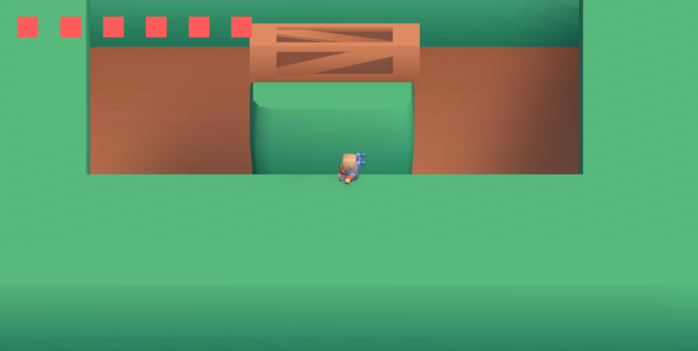
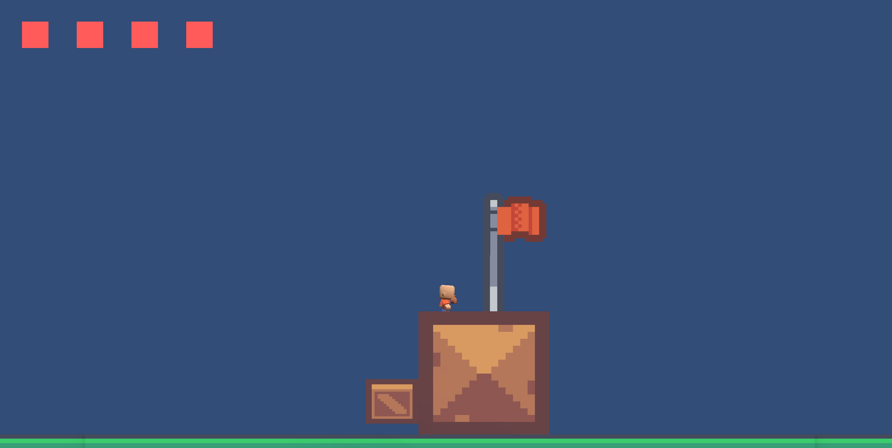
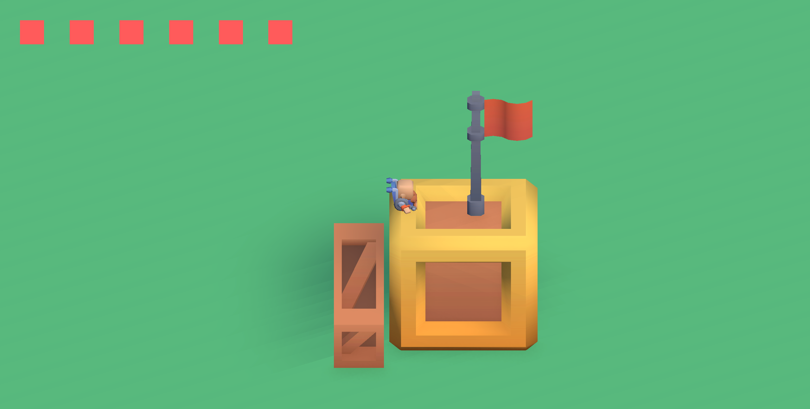

# Switch World — Puzzle 2D / 3D

Prototype de puzzle game en Unity où le joueur bascule entre une vue 2D et une vue 3D pour progresser dans les niveaux.

Projet réalisé en une semaine.





## Mécaniques

- Basculement en temps réel entre vue 2D et 3D
- Niveaux conçus autour de la dualité des perspectives

## Stack

- Unity 6000.1.17f1 (C#)

## Lancer le projet

```bash
git clone https://github.com/Lukas-Beden/E3C-Switch-World.git
```

Ouvrir dans Unity Hub et lancer la scène principale.

## Équipe

Projet réalisé en binôme en 1 semaine.  
**Lukas Beden** — système de switch dimensionnel (assets, physique, transition).
**Erwan Hamida** — character controller, ennemi et level design.
